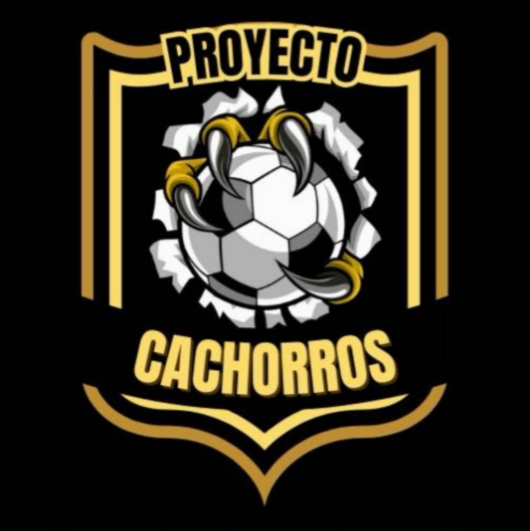

# 🏆 Proyecto Cachorros BA



**Sitio web oficial de la escuela de fútbol Proyecto Cachorros BA en Buenos Aires, Puntarenas, Costa Rica.**

## 📋 Descripción

Proyecto Cachorros BA es una escuela de fútbol comprometida con el desarrollo deportivo y la formación integral de niños y jóvenes de ambos géneros en el cantón de Buenos Aires de Puntarenas. Contamos con alrededor de 120 estudiantes de diversas comunidades de la región.

## ✨ Características

- 🎯 **Sitio web moderno** con diseño responsive
- ⚽ **Información completa** sobre categorías y entrenamientos
- 💰 **Sistema de pagos** con SINPE Móvil
- 📸 **Galería de fotos** interactiva
- 👨‍🏫 **Información de entrenadores** certificados
- 📱 **Optimizado para móviles** y tablets

## 🏗️ Tecnologías

- **Frontend**: React 18, Vite
- **Estilos**: Tailwind CSS
- **Animaciones**: Framer Motion
- **Iconos**: Lucide React
- **Routing**: React Router DOM
- **SEO**: React Helmet

## 🚀 Instalación y Desarrollo

### Prerrequisitos
- Node.js 16+ 
- npm o yarn

### Instalación
```bash
# Clonar el repositorio
git clone https://github.com/VASPABLO/proyecto-cachorros.git

# Navegar al directorio
cd proyecto-cachorros

# Instalar dependencias
npm install

# Ejecutar en modo desarrollo
npm run dev
```

### Comandos disponibles
```bash
npm run dev      # Servidor de desarrollo
npm run build    # Compilar para producción
npm run preview  # Vista previa del build
npm run lint     # Ejecutar linter
```

## 📂 Estructura del Proyecto

```
proyecto-cachorro/
├── public/
│   └── img/           # Imágenes estáticas
├── src/
│   ├── components/    # Componentes reutilizables
│   ├── pages/         # Páginas principales
│   ├── lib/           # Utilidades
│   └── ui/            # Componentes de UI
├── plugins/           # Plugins de Vite
└── tools/             # Herramientas de desarrollo
```

## 🏆 Categorías

- **Décima**: Nacidos 2018-2019-2020
- **Novena**: Nacidos 2016-2017
- **Octava**: Nacidos 2014-2015
- **Sétima**: Nacidos 2012-2013
- **Sexta**: Nacidos 2010-2011
- **Quinta**: Nacidos 2008-2009

## 📞 Contacto

- **Teléfono**: +506 8882-6308
- **SINPE Móvil**: 8708-3040
- **Email**: proyectocachorrosba@gmail.com
- **Ubicación**: Buenos Aires, Puntarenas, Costa Rica

## 👥 Entrenadores

- **Lic. Cristian Quesada González** - Entrenador Principal (Licencia A)
- **Douglas Ortíz Irigoyen** - Entrenador (Licencia C)
- **Oscar Espinoza Sibaja** - Entrenador (Licencia en trámite)
- **Jean Paul Quirós** - Entrenador de Porteros

## 🏅 Competencias

- Torneo de Apertura LINAFA
- Torneo de Clausura LINAFA
- Partidos Amistosos
- Torneos Locales

## 📄 Licencia

Este proyecto está bajo la Licencia MIT. Ver el archivo [LICENSE](LICENSE) para más detalles.

## 🤝 Contribuir

Las contribuciones son bienvenidas. Para cambios importantes, por favor abre un issue primero para discutir qué te gustaría cambiar.

---

**Desarrollado con ❤️ para la comunidad de Buenos Aires, Puntarenas**